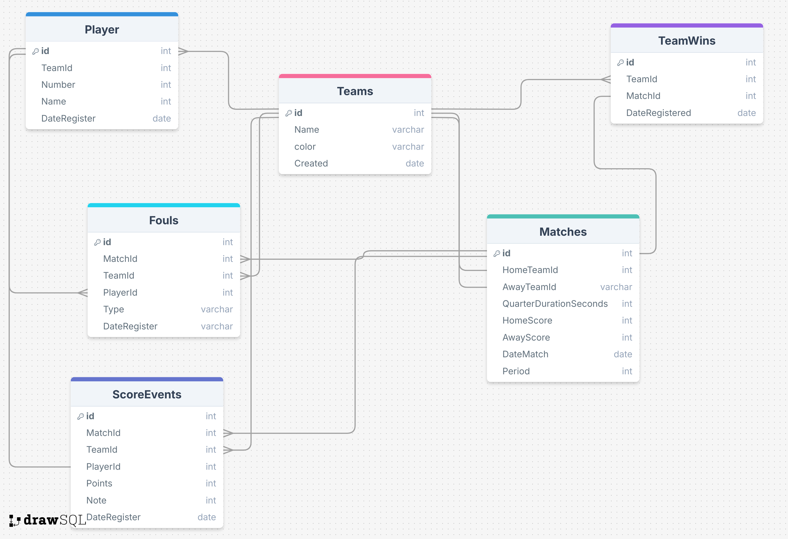

# Documentación del modelo de datos (Diagrama ER) — SQL Server 2022

---

# Diagrama de Entidad Relación

Base de datos para gestión de partidos entre equipos, jugadores, eventos de puntuación y faltas. Tablas principales:

- `Teams` — equipos.  
- `Player` — jugadores (vinculados a un equipo).  
- `Matches` — partidos entre equipos (home/away).  
- `ScoreEvents` — eventos de puntuación por jugador/equipo en un partido.  
- `Fouls` — faltas registradas en un partido (por jugador/equipo).  
- `TeamWins` — registro de victorias por partido / equipo.

---

# Entidades y atributos

## Teams
**Descripción:** almacena equipos.

- `id` `int` PRIMARY KEY (IDENTITY)  
- `Name` `varchar(100)` — nombre del equipo  
- `color` `varchar(50)` — color o tag del equipo  
- `Created` `date` — fecha creación del registro

## Player
**Descripción:** jugadores que pertenecen a un equipo.

- `id` `int` PRIMARY KEY (IDENTITY)  
- `TeamId` `int` — FK → `Teams(id)`  
- `Number` `int` — número de camiseta  
- `Name` `varchar(150)` — nombre del jugador  
- `DateRegister` `datetime` — fecha de registro

## Matches
**Descripción:** partido entre dos equipos.

- `id` `int` PRIMARY KEY (IDENTITY)  
- `HomeTeamId` `int` — FK → `Teams(id)`  
- `AwayTeamId` `int` — FK → `Teams(id)`  
- `QuarterDurationSeconds` `int` — duración de cuarto (segundos)  
- `HomeScore` `int` — marcador local final  
- `AwayScore` `int` — marcador visitante final  
- `DateMatch` `datetime` — fecha/hora del partido  
- `Period` `int` — periodo actual o total de periodos

## ScoreEvents
**Descripción:** eventos de puntuación durante un partido.

- `id` `int` PRIMARY KEY (IDENTITY)  
- `MatchId` `int` — FK → `Matches(id)`  
- `TeamId` `int` — FK → `Teams(id)` (equipo que anotó)  
- `PlayerId` `int` — FK → `Player(id)` (si aplica)  
- `Points` `int` — puntos anotados en el evento (1,2,3, etc.)  
- `Note` `varchar(255)` — nota o descripción del evento  
- `DateRegister` `datetime` — fecha/hora del evento

## Fouls
**Descripción:** faltas registradas.

- `id` `int` PRIMARY KEY (IDENTITY)  
- `MatchId` `int` — FK → `Matches(id)`  
- `TeamId` `int` — FK → `Teams(id)`  
- `PlayerId` `int` — FK → `Player(id)`  
- `Type` `varchar(50)` — tipo de falta (ej. técnica, personal)  
- `DateRegister` `datetime` — fecha/hora del registro

## TeamWins
**Descripción:** log de victorias (registro histórico por partido y equipo).

- `id` `int` PRIMARY KEY (IDENTITY)  
- `TeamId` `int` — FK → `Teams(id)`  
- `MatchId` `int` — FK → `Matches(id)`  
- `DateRegister` `datetime` — fecha registro de la victoria

---

# Relaciones y cardinalidades (resumen)
- `Teams` 1 — * N `Player`  
- `Teams` 1 — * N `Matches` (como `HomeTeam`) y 1 — * N `Matches` (como `AwayTeam`)  
- `Matches` 1 — * N `ScoreEvents`  
- `Matches` 1 — * N `Fouls`  
- `Player` 1 — * N `ScoreEvents`  
- `Player` 1 — * N `Fouls`  
- `TeamWins` relaciona `Teams` y `Matches` (normalmente 1 registro por partido indicando el ganador)