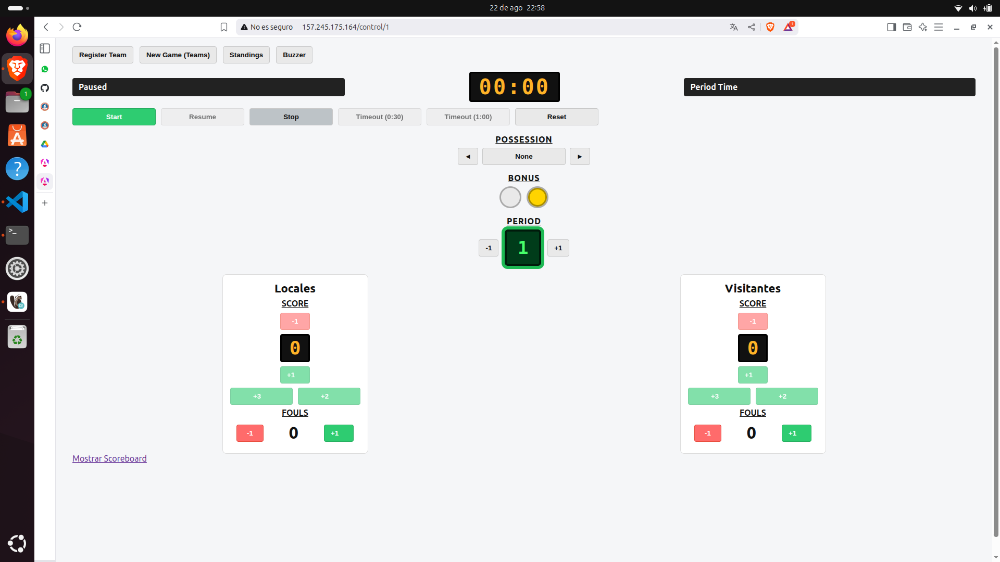
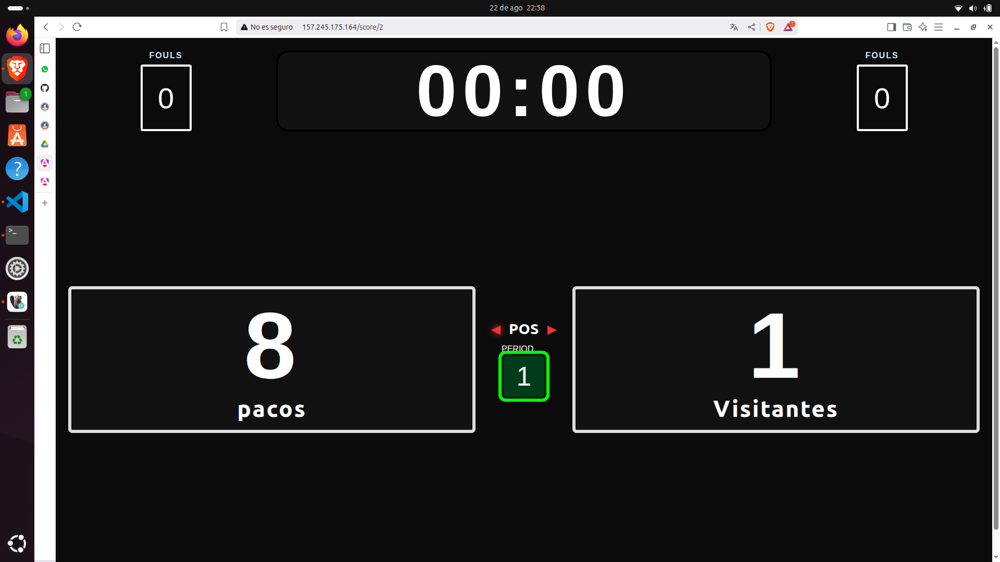

<h1><strong>PROYECTO 1 - DESARROLLO WEB</h1>

<h1><strong>MARCADOR DE BALONCESTO</h1>

# **Proyecto desarrollado por:**

---

#### Roberto Antonio Ramirez Gomez 7690-22-12700

#### Jean Klaus Castañeda Santos 7690-22-892

#### Jonathan Joel Chan Cuellar 7690-22-1805

---
# **Descripción de la aplicación web**
Esta aplicación nos permite controlar el marcador de partidos de baloncesto en tiempo real a travez de un tablero de control. 

## **La aplicación fue desarrollada con las siguientes tecnologías:**
* [x] Frontend: Angular
* [x] Backend: Dotnet
* [x] Base de Datos: sql server 2022

## **Se utilizarón herramientas como:**
* [x] Entity Framework: Para migración de datos. 
* [x] Signal IR: Para visualizar todos los cambios en tiempo real,.
* [x] Sweet Alert: Para la generación de alertas interactivas. 
* [x] Docker: Como contenedores de la aplicación.
* [x] Proxy Reverse: Para redireccionamiento de puertos.
* [x] VPS: Servidor donde se ejecuta la aplicación.

## **Enlaces para ver la documentación de la aplicación:**
[**Documentación Frontend**](https://github.com/rramirezg18/Tablero-Basket-PY1/blob/main/documentacion%20del%20FRONTED.md "Backend")

[**Documentación Backend**](https://github.com/rramirezg18/Tablero-Basket-PY1/blob/main/documentacion%20del%20BACKEND.md "Frontend")

[**Documentación Base de Datos**](https://github.com/rramirezg18/Tablero-Basket-PY1/blob/main/DocumentacionBD.md "Base de Datos")

## **Enlaces para prueba de la aplicación:**
[**http://157.245.175.164/control**](http://157.245.175.164/control "control")

[**http://157.245.175.164/score**](http://157.245.175.164/score "score")

